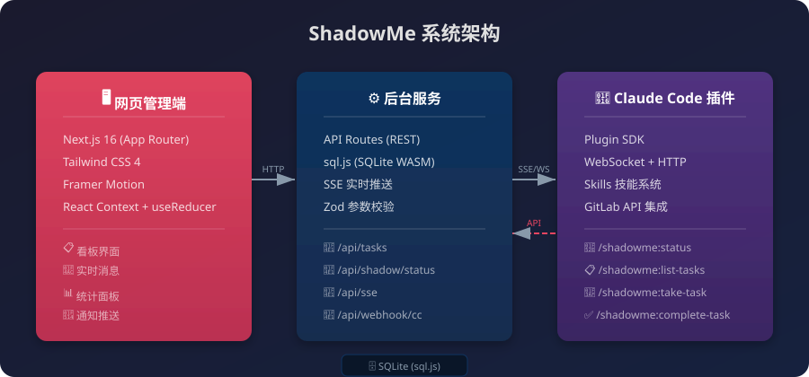
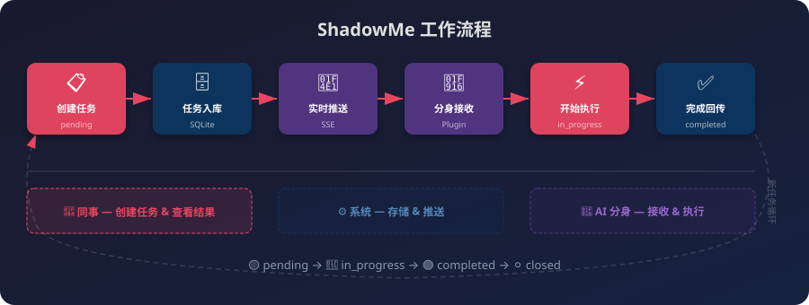
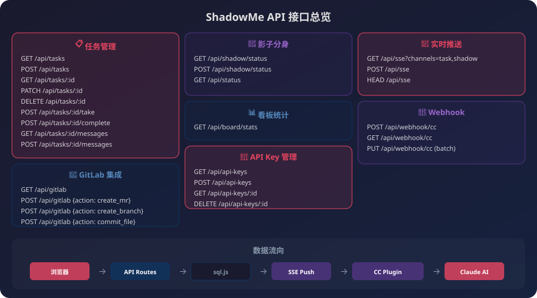

<div align="center">
  <h1>🤖 ShadowMe</h1>
  <p><strong>智能影子分身协作看板 — 让 AI 成为你的协作伙伴</strong></p>
  <p>
    <a href="https://github.com/xiaopengs/ShadowMe/stargazers">
      
    </a>
    <a href="https://github.com/xiaopengs/ShadowMe/issues">
      
    </a>
    <a href="https://github.com/xiaopengs/ShadowMe/blob/main/LICENSE">
      
    </a>
  </p>
</div>

---

## 💡 什么是 ShadowMe？

你是一个忙碌的开发者，团队成员需要你帮忙处理任务，但你分身乏术？

**ShadowMe 就是你的解决方案！** 它是一个智能协作看板系统：

- 📋 **同事在看板上创建任务** — 就像写便签一样简单
- 🤖 **影子分身自动接收任务** — Claude Code 充当你的 AI 分身
- ⚡ **AI 在本地帮你处理** — 代码审查、写文档、修 Bug
- ✅ **结果自动回传看板** — MR 链接、文档、摘要一目了然

**就像有了一个不知疲倦的小助手！**

---

## 🏗️ 系统架构

<p align="center">
  
</p>

ShadowMe 由三大模块组成：

| 模块 | 说明 | 技术栈 |
|------|------|--------|
| **网页管理端** | 可视化看板界面，任务管理 | Next.js 16 + Tailwind CSS + Framer Motion |
| **后台服务** | API 接口、数据库、实时推送 | Next.js API Routes + sql.js + SSE |
| **Claude Code 插件** | 连接 AI 分身，执行任务 | Claude Code Plugin SDK + WebSocket |

---

## 🔄 工作流程

<p align="center">
  
</p>

### 详细步骤

1. **创建任务** — 同事在网页端创建任务，填写标题、类型、优先级
2. **任务入库** — 后台将任务存入 SQLite，状态设为 `pending`
3. **实时推送** — SSE 将新任务通知推送给插件
4. **分身接收** — Claude Code 插件收到通知，自动或手动领取
5. **开始执行** — 状态变为 `in_progress`，AI 开始处理
6. **完成回传** — AI 处理完毕，提交结果（MR 链接/文档/摘要）
7. **看板更新** — 状态变为 `completed`，同事看到结果

---

## 📡 API 接口一览

<p align="center">
  
</p>

### 任务管理

| 方法 | 路径 | 说明 |
|------|------|------|
| `GET` | `/api/tasks` | 获取任务列表（支持 `?status=pending` 筛选） |
| `POST` | `/api/tasks` | 创建任务 |
| `GET` | `/api/tasks/:id` | 获取任务详情 |
| `PATCH` | `/api/tasks/:id` | 更新任务 |
| `DELETE` | `/api/tasks/:id` | 删除任务 |
| `POST` | `/api/tasks/:id/take` | 领取任务（pending → in_progress） |
| `POST` | `/api/tasks/:id/complete` | 完成任务（in_progress → completed） |

### 消息

| 方法 | 路径 | 说明 |
|------|------|------|
| `GET` | `/api/tasks/:id/messages` | 获取任务消息列表 |
| `POST` | `/api/tasks/:id/messages` | 发送消息 |

### 影子分身

| 方法 | 路径 | 说明 |
|------|------|------|
| `GET` | `/api/shadow/status` | 获取分身状态 |
| `POST` | `/api/shadow/status` | 更新分身状态（心跳） |

### 看板统计

| 方法 | 路径 | 说明 |
|------|------|------|
| `GET` | `/api/board/stats` | 看板统计数据 |
| `GET` | `/api/status` | 系统整体状态 |

### 实时推送

| 方法 | 路径 | 说明 |
|------|------|------|
| `GET` | `/api/sse` | SSE 事件流（`?channels=task,shadow,stats`） |
| `POST` | `/api/sse` | 订阅特定频道 |

### Webhook & GitLab

| 方法 | 路径 | 说明 |
|------|------|------|
| `POST` | `/api/webhook/cc` | Claude Code Webhook 回调 |
| `GET` | `/api/webhook/cc` | Webhook 协议信息 |
| `GET` | `/api/gitlab` | 获取 GitLab 项目信息 |
| `POST` | `/api/gitlab` | GitLab 操作（创建 MR/分支/提交） |

### API Key 管理

| 方法 | 路径 | 说明 |
|------|------|------|
| `GET` | `/api/api-keys` | 列出所有 API Key |
| `POST` | `/api/api-keys` | 创建新 API Key |
| `GET` | `/api/api-keys/:id` | 获取 API Key 详情 |

---

## 🚀 快速开始

### 前置条件

- **Node.js 20+**（[下载地址](https://nodejs.org)）
- **VS Code** + **Claude Code 扩展**（从 VS Code 扩展商店安装）
- **Claude Pro / Max 账号**

### 第一步：安装看板

```bash
# 1. 克隆项目
git clone https://github.com/xiaopengs/ShadowMe.git
cd ShadowMe

# 2. 安装依赖
npm install

# 3. 配置环境变量
cp .env.example .env.local

# 4. 初始化数据库
npm run db:init

# 5. 启动！
npm run dev
```

打开浏览器访问 **http://localhost:3000** 🎉

### 第二步：安装 Claude Code 扩展

1. 打开 VS Code
2. 按 `Ctrl+Shift+X`（Mac: `Cmd+Shift+X`）
3. 搜索 **"Claude Code"**，安装官方扩展（Anthropic 出品）
4. 点击 Spark 图标 ✨，登录你的 Claude 账号

### 第三步：安装 ShadowMe 插件

**方式一：通过 UI 添加（推荐）**

1. 在 Claude Code 对话框输入 `/plugins`
2. 点击 **Marketplaces** 标签
3. 添加项目根目录：

   | 系统 | 路径 |
   |------|------|
   | Mac/Linux | `/workspace/ShadowMe` |
   | Windows | `D:\AICoding\trea\ShadowMe` |

4. 刷新，回到 **Plugins** 标签，找到 **shadowme**，点击 **Install**

**方式二：命令行加载**

```bash
# Mac/Linux
claude --plugin-dir /workspace/ShadowMe/plugins/ShadowMe-plugin

# Windows PowerShell
claude --plugin-dir D:\AICoding\trea\ShadowMe\plugins\ShadowMe-plugin
```

### 第四步：配置插件（可选）

```bash
cd plugins/ShadowMe-plugin
cp .env.example .env
```

编辑 `.env`：

```env
SHADOW_BOARD_URL=http://localhost:3000

# GitLab（可选）
GITLAB_URL=https://gitlab.example.com
GITLAB_TOKEN=glpat-你的token
GITLAB_DEFAULT_PROJECT=123
WORKING_DIRECTORY=D:\AICoding\trea
```

### 第五步：开始使用！

| 命令 | 功能 |
|------|------|
| `/shadowme:status` | 检查看板状态 |
| `/shadowme:list-tasks` | 列出所有任务 |
| `/shadowme:create-task` | 创建任务 |
| `/shadowme:take-task` | 领取任务 |
| `/shadowme:complete-task` | 完成任务 |

---

## 📁 项目结构

```
ShadowMe/
├── src/
│   ├── app/
│   │   ├── api/                    # 后台 API 接口
│   │   │   ├── status/             # 系统状态
│   │   │   ├── tasks/              # 任务 CRUD + 领取/完成
│   │   │   ├── tasks/[id]/messages/# 任务消息
│   │   │   ├── shadow/status/      # 影子分身状态
│   │   │   ├── board/stats/        # 看板统计
│   │   │   ├── sse/                # SSE 实时推送
│   │   │   ├── webhook/cc/         # Claude Code Webhook
│   │   │   ├── gitlab/             # GitLab 代理
│   │   │   └── api-keys/           # API Key 管理
│   │   ├── page.tsx                # 首页（看板）
│   │   └── layout.tsx              # 布局
│   ├── components/                 # UI 组件
│   ├── context/                    # 全局状态
│   ├── lib/                        # 工具库（db, logger, sse-manager...）
│   └── types/                      # TypeScript 类型
├── plugins/
│   └── ShadowMe-plugin/            # Claude Code 插件
│       ├── .claude-plugin/         # 插件清单
│       ├── skills/                 # 插件技能
│       └── src/                    # 插件源码
├── .claude-plugin/
│   └── marketplace.json            # 插件市场清单
├── data/                           # SQLite 数据库（自动生成）
├── scripts/                        # 脚本
└── docs/                           # 文档 & 图表
```

---

## 🔧 生产部署

### PM2 守护进程

```bash
npm run build
pm2 start npm --name "shadowme" -- start
pm2 save
```

### Nginx 反向代理

```nginx
server {
    listen 80;
    server_name shadowme.your-domain.com;

    location / {
        proxy_pass http://127.0.0.1:3000;
        proxy_http_version 1.1;
        proxy_set_header Upgrade $http_upgrade;
        proxy_set_header Connection "upgrade";
        proxy_set_header Host $host;
        proxy_cache_bypass $http_upgrade;
    }
}
```

### 局域网访问

```bash
# 修改启动端口和监听地址
HOST=0.0.0.0 PORT=3000 npm run dev
```

---

## ❓ 常见问题

### 1. npm install 失败？

1. 检查 Node.js 版本：`node -v`（需要 >= 20）
2. 删除重来：`rm -rf node_modules package-lock.json && npm install`
3. 换镜像源：`npm config set registry https://registry.npmmirror.com`

### 2. localhost:3000 打不开？

1. 确认 `npm run dev` 正在运行
2. 换端口：`PORT=8080 npm run dev`
3. 检查防火墙设置

### 3. 插件找不到？

1. 确认输入了 `/plugins` 打开 "Manage plugins" 界面
2. 在 **Marketplaces** 标签添加路径（项目根目录，不是插件子目录）
3. 刷新 marketplaces
4. 重试 `/reload-plugins`

### 4. Windows 路径怎么写？

| 系统 | 路径写法 |
|------|---------|
| Mac/Linux | `/workspace/ShadowMe` |
| Windows | `D:\AICoding\trea\ShadowMe` |

路径有空格用引号：`"D:\My Projects\ShadowMe"`

### 5. /api/status 返回 404？

确保使用最新代码，已添加 `/api/status` 接口。拉取最新代码后重启：

```bash
git pull
npm run dev
```

---

## 🛠️ 技术栈

| 技术 | 用途 |
|------|------|
| Next.js 16 | React 全栈框架 |
| TypeScript | 类型安全 |
| sql.js | 纯 JS 数据库（跨平台，无需编译） |
| Tailwind CSS 4 | 样式框架 |
| Framer Motion | 动画效果 |
| Lucide React | 图标库 |
| SSE | 实时事件推送 |
| Claude Code Plugin SDK | AI 插件集成 |

---

## 🤝 贡献指南

1. Fork 本仓库
2. 创建分支：`git checkout -b feature/your-feature`
3. 提交代码：`git commit -m 'Add amazing feature'`
4. 推送分支：`git push origin feature/your-feature`
5. 创建 Pull Request

---

## 📜 许可证

MIT — 详见 [LICENSE](LICENSE) 文件

---

<div align="center">
  <p>Made with ❤️ by ShadowMe Team</p>
</div>
